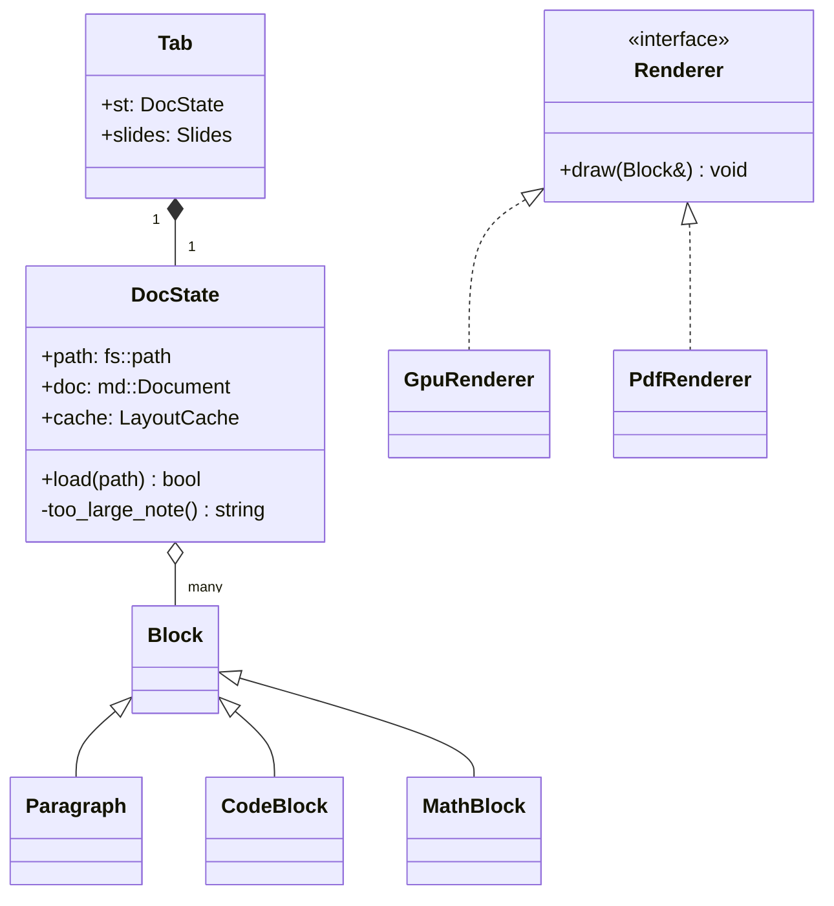

# Class diagram with an interface annotation

```mermaid
classDiagram
    class DocState {
        +path: fs::path
        +doc: md::Document
        +cache: LayoutCache
        +load(path) bool
        -too_large_note() string
    }
    class Tab {
        +st: DocState
        +slides: Slides
    }
    class Renderer {
        <<interface>>
        +draw(Block&) void
    }
    Tab "1" *-- "1" DocState
    DocState o-- "many" Block
    Block <|-- Paragraph
    Block <|-- CodeBlock
    Block <|-- MathBlock
    Renderer <|.. GpuRenderer
    Renderer <|.. PdfRenderer
```
