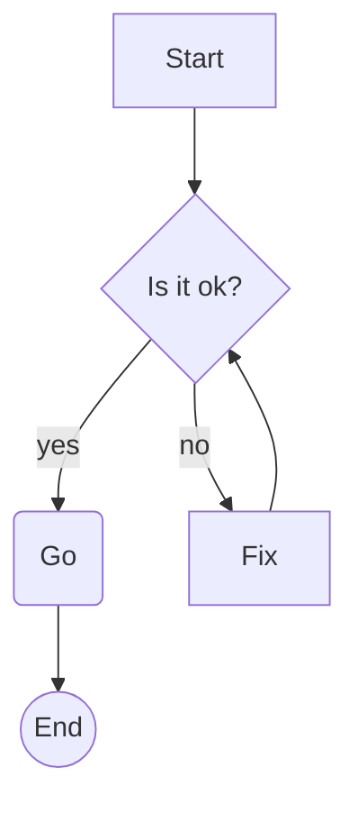
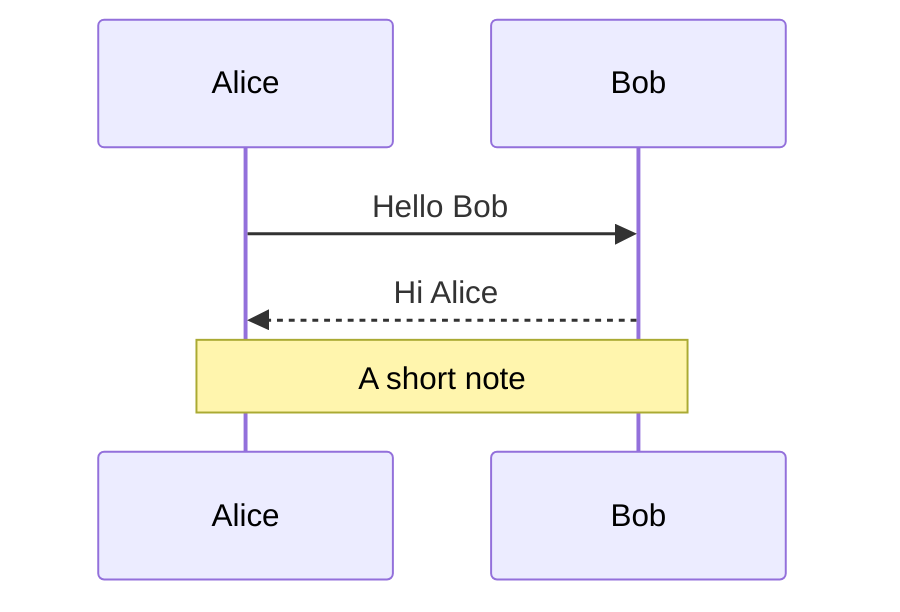

# Mermaid

```mermaid
flowchart TD
    A[Start] --> B{Is it ok?}
    B -->|yes| C(Go)
    B -->|no| D[Fix]
    D --> B
    C --> E((End))
```

```mermaid
sequenceDiagram
    participant A as Alice
    participant B as Bob
    A->>B: Hello Bob
    B-->>A: Hi Alice
    Note over A,B: A short note
```
